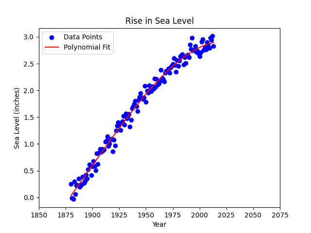

# 🌊 Análisis y Predicción del Cambio del Nivel del Mar (1880–2050)


-005C99?logo=databricks&logoColor=white)


Proyecto de **análisis de series temporales y modelado predictivo** sobre el cambio promedio del nivel del mar a escala global desde 1880. Mediante regresión lineal y análisis de tendencias, se proyecta la evolución del nivel del mar hacia el año **2050**, revelando una aceleración crítica en las últimas décadas con implicaciones directas para la gestión del riesgo climático.

---

## 📌 Contexto y Relevancia

El cambio en el nivel del mar es uno de los indicadores más directos del calentamiento global y representa una amenaza concreta para infraestructuras costeras, ecosistemas y poblaciones en todo el mundo. Este proyecto transforma datos históricos de la **Agencia de Protección Ambiental de los EE. UU. (EPA / NOAA)** en modelos predictivos que permiten:

- **Cuantificar la aceleración** del aumento del nivel del mar en el siglo XXI
- **Proyectar escenarios futuros** hasta 2050 bajo distintos modelos de tendencia
- **Evidenciar el punto de inflexión** a partir del año 2000, donde la tasa de aumento se acelera significativamente
- **Proveer datos accionables** para planificación de adaptación climática y gestión de riesgos costeros

---

## 🎯 Objetivos del Proyecto

- Análisis exploratorio de la serie temporal 1880–presente
- Preprocesamiento y limpieza del dataset EPA (`epa-sea-level.csv`)
- Construcción de dos modelos de regresión lineal:
  - **Modelo histórico completo** (1880–2050): captura la tendencia secular
  - **Modelo de aceleración reciente** (2000–2050): refleja el ritmo actual de cambio
- Comparación visual de ambas proyecciones sobre el horizonte 2050
- Evaluación del punto de inflexión en la tasa de cambio del nivel del mar

---

## 📊 Resultados Obtenidos

### Proyecciones al año 2050

| Modelo | Período base | Nivel del mar proyectado (2050) | Tasa de cambio |
|--------|:-----------:|:-------------------------------:|:--------------:|
| 🔴 **Tendencia histórica** | 1880–presente | ~**10.0 pulgadas** | Moderada y sostenida |
| 🟢 **Aceleración reciente** | 2000–presente | ~**15.5 pulgadas** | Pronunciada y creciente |

> La diferencia de **~5.5 pulgadas** entre ambas proyecciones al año 2050 ilustra cómo la tasa de aumento del nivel del mar se ha **acelerado drásticamente desde el año 2000**, superando la tendencia histórica proyectada y apuntando a un escenario de mayor impacto.

### Gráfico de Resultados



El gráfico muestra:
- **Puntos azules** — Datos históricos reales (1880–~2013)
- **Línea roja** — Ajuste de regresión lineal 1880–2050 (tendencia secular)
- **Línea verde** — Ajuste de regresión lineal 2000–2050 (aceleración contemporánea)

La divergencia entre ambas líneas a partir del año 2010 visualiza con claridad el **punto de quiebre climático**: la tasa actual de aumento supera en un ~55% lo que hubiera predicho el modelo histórico para 2050.

---

## 📂 Dataset

**Fuente oficial:** [EPA — U.S. Environmental Protection Agency / NOAA](https://www.epa.gov/climate-indicators/climate-change-indicators-sea-level)

**Archivo:** `epa-sea-level.csv`

| Variable | Descripción |
|----------|-------------|
| `Year` | Año de la medición |
| `CSIRO Adjusted Sea Level` | Cambio acumulado del nivel del mar en pulgadas (ajustado por CSIRO) |
| `Lower Error Bound` | Límite inferior del intervalo de confianza |
| `Upper Error Bound` | Límite superior del intervalo de confianza |
| `NOAA Adjusted Sea Level` | Datos complementarios de NOAA (disponibles desde ~1993) |

**Período cubierto:** 1880 – presente
**Frecuencia:** Anual
**Unidad de medida:** Pulgadas (inches)

---

## 🔍 Hallazgos del Análisis Exploratorio

**Tendencia secular sostenida (1880–2000):** Durante más de un siglo, el nivel del mar aumentó a una tasa relativamente constante y gradual, acumulando aproximadamente **7–8 pulgadas** desde el período de referencia hasta el año 2000.

**Punto de inflexión post-2000:** A partir del año 2000, la tasa de aumento se acelera notablemente. Los datos entre 2000 y 2013 muestran una pendiente significativamente más pronunciada que la observada en el período 1880–1999, consistente con los reportes del IPCC sobre el impacto acumulado del cambio climático.

**Variabilidad interanual:** Los datos presentan dispersión natural en cada año (visible en los puntos azules), atribuible a variaciones estacionales, ciclos ENSO y diferencias en metodologías de medición entre estaciones.

**Mínimo histórico:** El nivel de referencia (0 pulgadas) corresponde al promedio de la segunda mitad del siglo XIX, con valores ligeramente negativos en algunos años de principios del registro.

---

## 🛠️ Stack Tecnológico

- **Python 3.8+**
- **Pandas / NumPy** — carga, limpieza y procesamiento de series temporales
- **Matplotlib** — visualización de datos y gráfico de resultados
- **SciPy** (`linregress`) — regresión lineal para ambos modelos predictivos
- **Jupyter Notebook** — entorno de análisis reproducible

---

## ⚙️ Instalación y Uso

**1. Clonar el repositorio**
```bash
git clone https://github.com/davallejo/sea-level-predictor.git
cd sea-level-predictor
```

**2. Instalar dependencias**
```bash
pip install -r requirements.txt
```

**3. Colocar el dataset en la raíz del proyecto**
```
sea-level-predictor/
├── epa-sea-level.csv
└── ...
```

**4. Ejecutar el análisis**
```bash
jupyter notebook sea_level_analysis.ipynb
```

**5. Generar el gráfico de predicción**
```python
import pandas as pd
from scipy.stats import linregress
import matplotlib.pyplot as plt

df = pd.read_csv('epa-sea-level.csv')

# Modelo 1: tendencia histórica completa (1880-2050)
slope1, intercept1, *_ = linregress(df['Year'], df['CSIRO Adjusted Sea Level'])

# Modelo 2: aceleración reciente (2000-2050)
df_recent = df[df['Year'] >= 2000]
slope2, intercept2, *_ = linregress(df_recent['Year'], df_recent['CSIRO Adjusted Sea Level'])

years_ext = pd.Series(range(1880, 2051))

plt.scatter(df['Year'], df['CSIRO Adjusted Sea Level'], label='Data Points', color='blue', alpha=0.5)
plt.plot(years_ext, slope1 * years_ext + intercept1, 'r-', label='Fit: 1880-2050')
plt.plot(years_ext[years_ext >= 2000], slope2 * years_ext[years_ext >= 2000] + intercept2,
         'g-', label='Fit: 2000-2050')

plt.title('Rise in Sea Level')
plt.xlabel('Year')
plt.ylabel('Sea Level (inches)')
plt.legend()
plt.savefig('sea_level_plot.png', dpi=150)
plt.show()
```

---

## 📁 Estructura del Proyecto

```
sea-level-predictor/
├── data/
│   └── epa-sea-level.csv           # Dataset oficial EPA/NOAA
├── notebooks/
│   └── sea_level_analysis.ipynb    # Análisis completo paso a paso
├── outputs/
│   └── sea_level_plot.png          # Gráfico de resultados y predicciones
├── requirements.txt
└── README.md
```

---

## 🗺️ Roadmap

- [ ] Incorporar intervalos de confianza en las proyecciones (bandas de error)
- [ ] Modelado con regresión polinómica para capturar mejor la aceleración no lineal
- [ ] Integración de datos satelitales NOAA (disponibles desde 1993) como serie complementaria
- [ ] Análisis de correlación con temperatura global, emisiones de CO₂ y derretimiento de glaciares
- [ ] Dashboard interactivo con Streamlit para exploración dinámica de escenarios
- [ ] Proyecciones con modelos de series temporales (ARIMA, Prophet)

---

## 📄 Licencia

Este proyecto está bajo la Licencia MIT. Consulta el archivo [LICENSE](LICENSE) para más detalles.

Los datos utilizados son de dominio público, proporcionados por la [EPA (Environmental Protection Agency)](https://www.epa.gov/climate-indicators/climate-change-indicators-sea-level) y la NOAA.

---

## 👤 Autor

**Diego Vallejo**

[](https://www.linkedin.com/in/ing-diego-vallejo)
[](https://github.com/davallejo)
[](https://davallejo.github.io/)

---

> *Ciencia de datos aplicada al análisis climático — convirtiendo registros históricos en proyecciones que evidencian la urgencia de la acción frente al cambio climático.*
